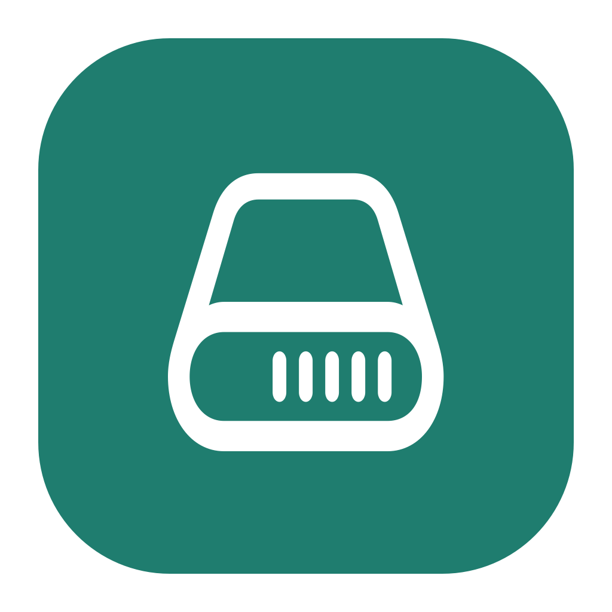

<p align="center">
  
</p>

<h1 align="center">DriveClue</h1>

<p align="center"><strong>Know what your drive is telling you.</strong></p>

<p align="center">
  
  
  
  <a href="LICENSE"></a>
</p>

<p align="center">
  <a href="https://driveclue.github.io/">Website</a> · <a href="https://github.com/driveclue/DriveClue">Source code</a>
</p>

<p align="center">
  A free, open source macOS app for understanding the health of your drives.<br>
  See the important signals, follow changes over time, and know when a drive needs attention.
</p>

## Why DriveClue?

DriveClue turns drive health data into a readable dashboard. It combines an overall health view with the underlying S.M.A.R.T. and NVMe values, so you can see *why* a drive has a particular status.

- **Health at a glance:** overall health, SSD life, temperature, problems, and important indicators.
- **The details when you need them:** searchable health indicators, device statistics, error logs, and ATA self-test results.
- **History on your Mac:** local trends for health, SSD life, temperature, and data written.
- **Reports and alerts:** save a report, set free-space alerts, and optionally send email reports.
- **Menu bar access:** check drive status without keeping the main window open.

## Drive support

| Connection | What DriveClue can read |
| --- | --- |
| Internal Apple Silicon NVMe SSD | NVMe health information through macOS, without an administrator password. |
| Internal SATA, Thunderbolt, and eSATA | ATA or NVMe data when macOS exposes the drive interface. |
| USB and FireWire | S.M.A.R.T. data only when a compatible SAT SMART driver is already installed. DriveClue does not install a kernel extension. |

Short and full self-tests are available for supported **ATA** drives. macOS does not expose NVMe self-tests for Apple internal SSDs, so those controls are disabled there. The classic ATA error log is also unavailable for Apple internal SSDs; DriveClue can still show the NVMe error-entry count.

Health percentages are estimates based on published failure signals such as reallocated or pending sectors, SSD wear, and critical warnings. CRC errors are treated as a possible cable issue. These scores may differ from those in other drive utilities.

## Get started

DriveClue requires **macOS 14 or later** on Apple Silicon or Intel. To build it, install Xcode and [XcodeGen](https://github.com/yonaskolb/XcodeGen), then run:

```bash
xcodegen generate
xcodebuild -project DriveClue.xcodeproj -scheme DriveClue -configuration Release -destination 'platform=macOS' -derivedDataPath DerivedData build
open DerivedData/Build/Products/Release/DriveClue.app
```

Select a drive in the sidebar to see its dashboard. Use **Check now** to refresh the readings, or open **Health Indicators**, **Device Statistics**, **Errors Log**, and **Self-tests** for more detail. **Save Report…** exports the current findings.

### For contributors

The macOS app is in `App/`; drive reading, scoring, reports, and history are in the `DriveClueCore` Swift package. Run the core tests with:

```bash
swift test --package-path DriveClueCore
```

To inspect the same scan data from the command line:

```bash
swift run --package-path DriveClueCore DriveClueProbe
```

Forks and pull requests are welcome. Please explain the behavior you changed and include a test when it guards a meaningful case.

<details>
<summary>Signing and notarizing a release build</summary>

The release build can be signed with a Developer ID Application certificate:

```bash
codesign --force --options runtime --timestamp --sign "Developer ID Application: YOUR NAME (TEAMID)" \
  "DerivedData/Build/Products/Release/DriveClue.app"
ditto -c -k --keepParent "DerivedData/Build/Products/Release/DriveClue.app" DriveClue.zip
xcrun notarytool submit DriveClue.zip --keychain-profile AC_PASSWORD --wait
xcrun stapler staple "DerivedData/Build/Products/Release/DriveClue.app"
hdiutil create -volname DriveClue -srcfolder "DerivedData/Build/Products/Release/DriveClue.app" -ov DriveClue.dmg
```

Notarization needs an App Store Connect API key or an app-specific password stored with `notarytool store-credentials`. A Developer ID signature alone is not notarization.

</details>

## Privacy

DriveClue reads drive health information from macOS. To show trends and changes between scans, it saves drive health samples on your Mac in `~/Library/Application Support/DriveStats/history.sqlite`.

Email reports are off by default. If you enable them in Settings, DriveClue can send a report through Apple Mail or an SMTP server you configure. An SMTP password, if you enter one, is stored in macOS Keychain.

## License and redistribution

Copyright © 2026 Tran Tuan. DriveClue is licensed under the **GNU General Public License v3.0 only** ([GPLv3](LICENSE)). You may use, study, modify, fork, and redistribute the app. If you distribute a modified version, you must license the covered work under GPLv3, preserve the required notices, identify your changes, and provide the corresponding source code to recipients as the license requires.

DriveClue is provided free of charge by this project. **GPLv3 also permits others to charge for copies of their forks.** Recipients keep the right to receive the corresponding source code and to share it further, including for free. The license does not impose a zero-price rule on redistribution.

DriveClue is not affiliated with Binary Fruit or DriveDx.

## Support the project

<!-- Add your Buy Me a Coffee URL around this badge when it is ready. -->

